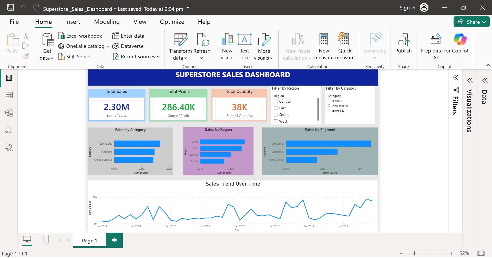

# 📊 Superstore Sales Analysis Dashboard

## 📌 Project Overview
This is an end-to-end Data Analytics project that analyzes Superstore sales data using SQL, Python, Excel, and Power BI. The project includes data cleaning, SQL analysis, and an interactive Power BI dashboard to identify business insights and sales trends.

---

## 🎯 Objectives
- Analyze overall sales performance
- Identify top-performing categories and regions
- Track monthly sales trends
- Compare sales across customer segments
- Build an interactive dashboard for decision-making

---

## 🛠️ Tools & Technologies
- SQL
- Python (Pandas)
- Microsoft Excel
- Power BI

---

## 📂 Project Workflow
1. Collected the Superstore dataset.
2. Cleaned and prepared the data using Python and Excel.
3. Performed SQL queries for business analysis.
4. Imported the cleaned data into Power BI.
5. Created an interactive dashboard with KPIs and charts.

---

## 📈 Dashboard Features
- Total Sales KPI
- Total Profit KPI
- Total Quantity KPI
- Sales by Category
- Sales by Region
- Sales by Segment
- Monthly Sales Trend
- Region Filter
- Category Filter

---

## 📊 Key Insights
- Technology generated the highest sales.
- Consumer segment contributed the most revenue.
- West region recorded the highest sales.
- Monthly sales trend shows seasonal variations.

---

## 📁 Repository Contents
- `Sample_Superstore.csv` – Raw dataset
- `Clean_Superstore_Data.csv` – Cleaned dataset
- `data_cleaning.py` – Python data cleaning script
- `Superstore_Sales_Dashboard.pbix` – Power BI dashboard
- `Dashboard_Screenshot.png` – Dashboard preview

---

## 📷 Dashboard Preview

> Add your dashboard screenshot below.

---

## 🚀 Skills Demonstrated
- Data Cleaning
- Data Analysis
- SQL Queries
- Data Visualization
- Dashboard Design
- Business Insights
- KPI Reporting

---

## 👩‍💻 Author
**Chakshu Maheshwari**

Aspiring Data Analyst passionate about transforming data into meaningful business insights using SQL, Python, Excel, and Power BI.
